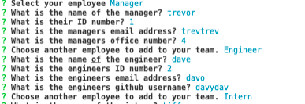
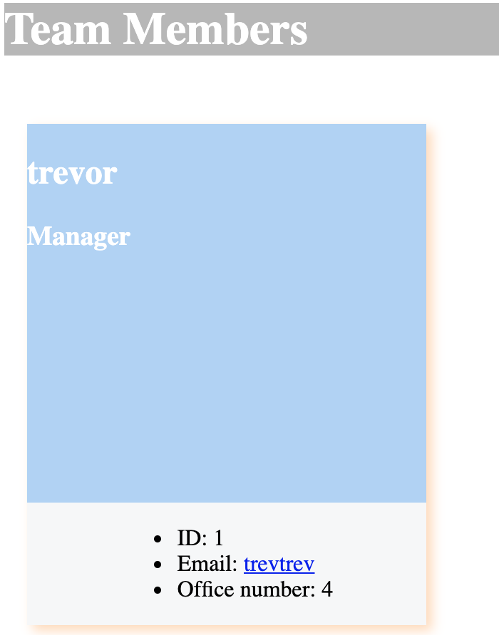

# My-Offices-Team-Profile-Generator

  ************************

  

  ## Table of Contents
  1.  [Description](#Description)
  2.  [Installation](#Installation)
  3.  [Usage](#Usage)
  4.  [License](#License)
  5.  [Contributing](#Contributing)
  6.  [Tests](#Tests)
  7.  [Questions](#Questions)

  ## Description
  This application is designed to quickly and easily generate a webpage that displays my teams basic info so that I have quick access to their emails and Github profiles. . You simply install inquirer, run the code and answer a few questions about your team. You are then presented with a html file containing all your answers in a clear layout.

  ## Installation

  *npm i*
 

  ## Usage
  Nothing special, you should be go to go!

  ## License
 This application has the following license:
 [MIT License](https://opensource.org/licenses/MIT)

  ## Contributing
  Please email me to discuss further.

  ## Tests
*npm test*

 

## Questions
*If you would like to know more or have a question you'd like to ask, please contact me via email marc.malliate@gmail.com or you may also like to checkout my work [here](https://github.com/marcmalliate)*

### You may also like to view the GitHub repository which contains the code repository: 
https://github.com/marcmalliate/My-Offices-Team-Profile-Generator

### Screenshot of application:

### Video demonstration of application:
https://watch.screencastify.com/v/MIdum5nVSUjJ0QsTTtNX

© *2021 Marc Malliate - Professional Readme Generator*

